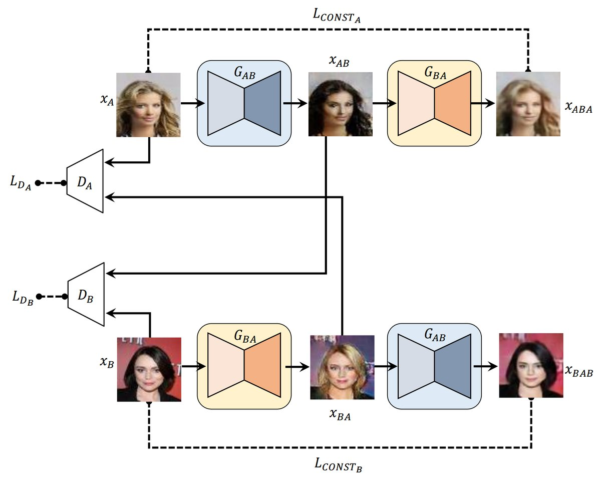

# DiscoGAN in Tensorflow

Implementation of [Learning to Discover Cross-Domain Relations with Generative Adversarial Networks](https://arxiv.org/abs/1703.05192).

## Requirements

- Tensorflow 1.0.1
- Python 3.5.2
- Pillow
- wget

## Download code
~~~~
git clone https://github.com/GunhoChoi/GAN_simple.git
cd ./GAN_simple/DiscoGAN
~~~~~

## Download Image
~~~
python3 ./down_resize_crop.py
~~~
## Train Model
~~~
python3 ./DiscoGAN.py
~~~
## Result

 under training..
